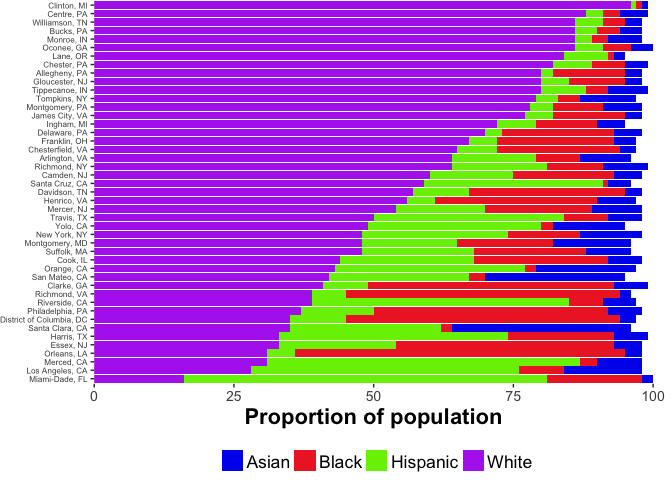
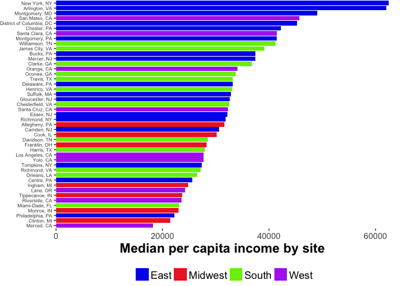

Make PLAY collection site demographic figs
================

    ## Login successful.

    ## Sending GET to https://nyu.databrary.org/slot/26338/0/asset/117088/download?inline=false

    ## Successful HTML GET query.

    ## No encoding supplied: defaulting to UTF-8.

    ## Joining, by = "region"

    ## Joining, by = c("State", "County")

    ## Scale for 'fill' is already present. Adding another scale for 'fill',
    ## which will replace the existing scale.

    ## Saving plot of PLAY data collection site race data to figs/

    ## Saving plot of PLAY data collection site economic data to figs/
