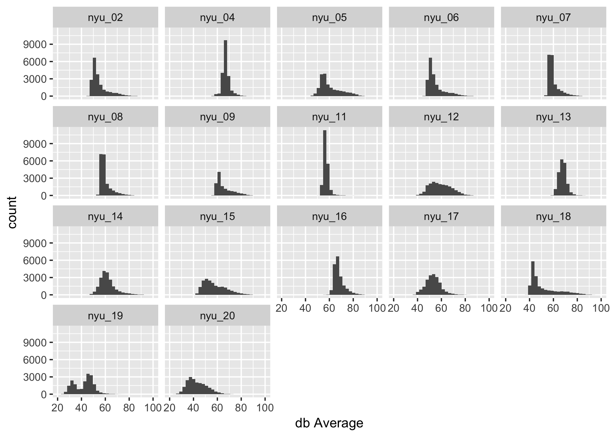
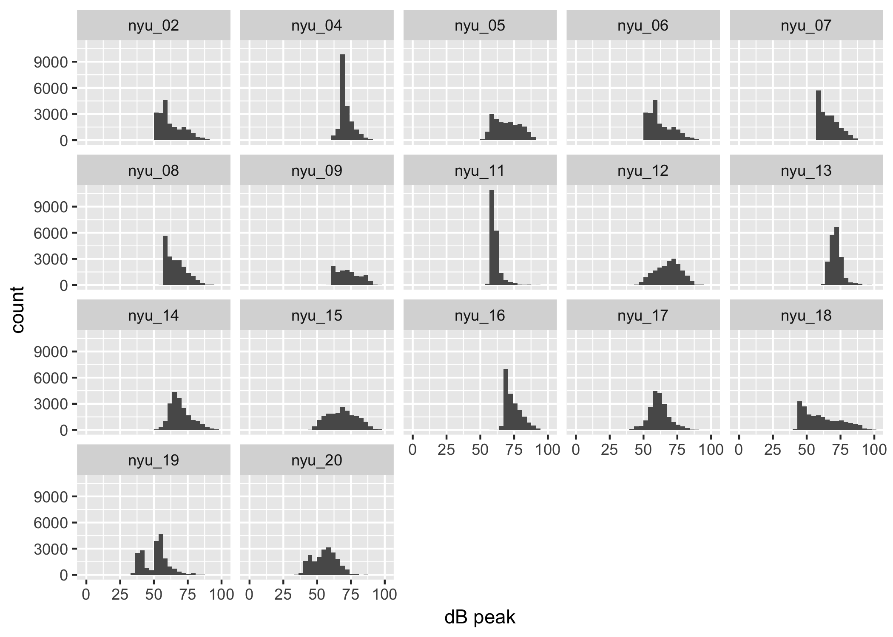
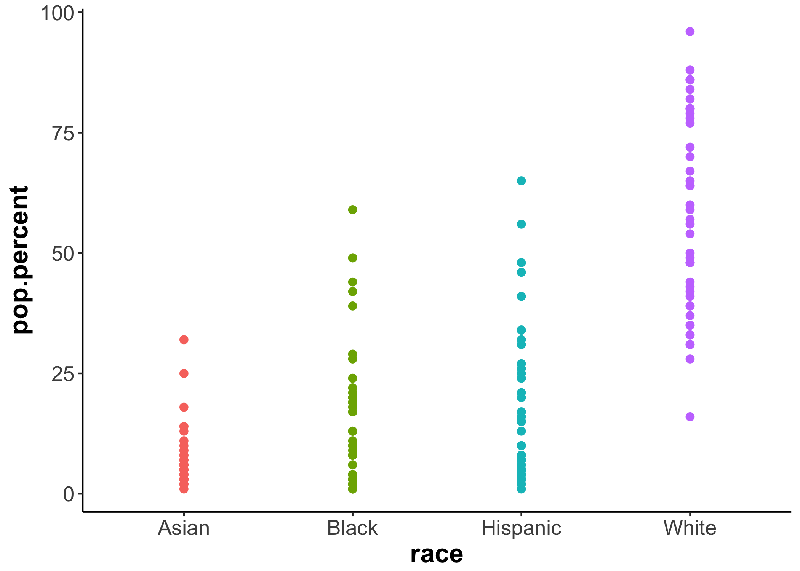
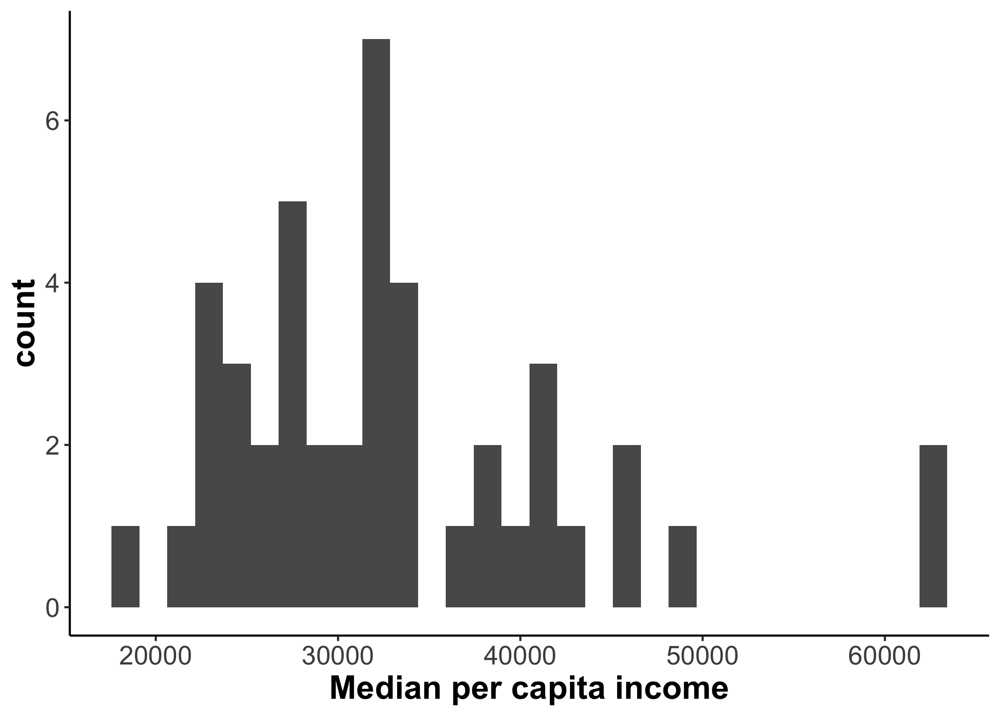

Examining play and learning across a year: The PLAY Project
================
true

-   [Project Planning](#project-planning)
-   [Pilot Study](#pilot-study)
    -   [Methods](#methods)
        -   [Participants](#participants)
        -   [Procedure](#procedure)
        -   [Data analysis](#data-analysis)
    -   [Results](#results)
        -   [Demographic and self-report measures](#demographic-and-self-report-measures)
        -   [Ambient sound levels](#ambient-sound-levels)
        -   [Video coding](#video-coding)
    -   [Discussion](#discussion)
-   [Proposed study](#proposed-study)
    -   [Methods](#methods-1)
        -   [Participants](#participants-1)
-   [`{r PLAY-ed-plot} # # Plot education #`](#r-play-ed-plot-plot-education)
-   
-   [`{r PLAY-site-map} #  #`](#r-play-site-map)
    -   [Procedure](#procedure-1)
    -   [Video coding](#video-coding-1)
    -   [Data analysis](#data-analysis-1)
-   [General Discussion](#general-discussion)
-   [References](#references)

Behavior lies at the heart of developmental science1, and video is a uniquely powerful tool for capturing the richness and complexity of behavior2,3. Video documents the microstructure of behavior in real time and global patterns of change over development4,5—a 12-month-old’s single-word reference to a dog versus a 24-month- old’s multi-word declarative (“big doggie eat”). Video chronicles who did what, and how, when, and where they did it6—whether the dog was big, eating, jumping, or barking, whether the child looked at the dog, touched the dog, shied away from or approached the dog, and expressed interest, fear, or joy.

The overarching goal of the PLAY (Play & Learning Across a Year) project is to exploit the power of video to catalyze discovery and transform knowledge about behavioral development in infancy. The project capitalizes on the NICHD/NSF-funded Databrary video-sharing library7 and the Datavyu video-coding tool8 developed by Adolph and Gilmore (**???**), and the joint expertise of 65 PLAY “launch group” researchers in the United States and Canada. To do so, we will create the first, large-scale, sharable and reusable, transcribed, coded, and curated video corpus of human behavior. And we will advance new video-based means of documentation to increase transparency and reproducibility in behavioral science.

We named the project “PLAY” and use “unstructured play” and “everyday play” to broadly refer to infants’ natural activities while awake. To paraphrase Piaget9, Montessori10, and Bruner11,12, play is the work of infants. It is an approach to action, not a particular form of activity. Some of infants’ play involves toys and some play is joyful and goal directed, but all of their spontaneous vocalizations, interactions with objects and people, and locomotor bouts involve exploration and opportunities for learning and growth, regardless of affect or intent.

The project has three aims: 1. To create the first cross-domain, large-scale, transcribed, coded, and curated video corpus of human behavior—collected with a common protocol and coded with common criteria; 2. To answer fundamental questions about behavioral and developmental cascades; and 3. To demonstrate the scientific value, feasibility, and scalability of a synergistic approach to collaborative research, and advance new ways to use video as documentation to ensure transparency and reproducibility. In this paper, we describe the process of planning PLAY, our preliminary results from a pilot study, and plans for a larger scale implementation.

Project Planning
================

Planning began in late 2015. Adolph, Tamis-LeMonda and Gilmore (PLAY PIs) invited researchers to join the launch group based on their interest in open science and infant-mother natural activity in the home, willingness to collaborate on data collection and coding, lab location, and domains of expertise (language, gesture, play, object exploration, tool use, locomotion, posture, physical activity, emotion, temperament, parent responsiveness, gender, home environment, media use, spatial demography, and sampling). Nearly every invitee agreed. The current launch group consists of 65 from 49 from 24. 34% are new investigators, 68% women, 18 non-white, from varied institutions (public and private universities and colleges, hospitals, agencies) with varied resources (38 public universities, 18% R15-eligible institutions) across the United States and Canada.

To distribute the burden of video coding across researchers, the PLAY PIs recruited 10+ experts for each of four core coding passes—communication, object interaction, locomotion, and emotion. These domains represent key areas of development and provide foundational information when time-locked to video. Compared with other behaviors (e.g., visual attention), they are quick, easy, and reliable to code.

Through a yearlong series of telephone conversations with each launch group member and 12 group webinars (**???**), we jointly developed a common sampling method and protocol (including materials, technical specifications, questionnaires, and non-video measures), designed common video codes, and established an infrastructure to divide responsibilities between PLAY staff and launch group. We achieved consensus, with input from NICHD program staff, about all aspects of PLAY at a daylong workshop shared on Databrary56, at NIH in Dec 2016.

The launch group jointly decided that the centerpiece of PLAY would be 900 one-hour videos of infant-mother dyads during natural play in the home. Home videos are widely believed to be representative of natural activity, and provide a stark contrast to the 2- to 20-minute "snapshots" typical of standard structured lab tasks. Based on their extensive experience with naturalistic home observations43,44,46,57-61, launch group members determined that one hour is sufficiently long to capture an ecologically valid window into infant and mother natural behaviors. Longer recording times produce diminishing returns, risk infants becoming excessively tired or hungry, and increase the cost and burden to families and researchers.

Given the cost of going to families’ homes, the launch group also determined that we should augment natural play with a set of additional video, questionnaire, and non-video measures, that together would add only ~45 minutes to the home visit. This would enable researchers to test whether variations in natural play, or in characteristics of distal and proximal environments, predict infant and mother behaviors when materials and conditions are held constant. Thus, the solitary and dyadic play tasks are of interest in their own right, and might also serve as correlates in tests of experiential and environmental influences.

To obtain objective data on stable home conditions (cracks in walls, broken windows, ceiling stains, safety issues, etc.), physical layout (furniture, clutter, space to move, etc.), educational and electronic media (writing/drawing materials, TVs, computers, etc.), and gendered characteristics of infants’ room, toys, and clothes, we decided to conduct video home tours. Launch group experts also expressed interest in understanding whether clothing and footgear affect infants’ locomotion and physical activity, and each takes only moments to video record. Clothing/footgear videos can reveal gendered features (bows/frills, superhero emblems, patent leather shoes, army boots)66 and influences on spontaneous activity and locomotion67. The launch group also deemed important a variety of questionnaire measures of infant skills, experiences, and home environment: mothers’ report of infants’ vocabulary, locomotor milestones and falls, temperament, and use of gender labels; mother’s report of family demographics, media use, health, and home chaos; and a researcher-completed survey on physical characteristics of the home. The PIs developed a custom tablet-based app to collect these questionnaire data efficiently, limit data input errors, use a stylus for flexible data entry, and allow automatic transfer to permanent storage on Databrary. The launch group devised methods to measure room size with a commercial laser device and ambient noise level with a commercial decibel meter.

Finally, with input from the launch group, we decided to transcribe all mother speech and infant vocalizations in formats exportable to CHILDES. The launch group also developed “foundational,” time-locked codes of infant and mother behaviors in four core domains (communication/gesture, object interaction, locomotion, emotion). These codes should be informative even to non-experts and are designed to facilitate further discovery through subsequent coding passes that build on the prior work. Temporally aligned transcriptions and codes should enable researchers with expertise in any domain to analyze cascades within and among these behaviors.

Pilot Study
===========

Based on the launch group's recommendations, we carried out a pilot study to test the feasibility of the approach.

Methods
-------

### Participants

A total of *n*= 20 infants were tested, *n*= 4 12-month-olds (3 female), *n*= 12 18-month-olds (5 female), and *n*= 4 (0 female) 24-month-olds. All were from the New York City area. Fifteen infants were White, one was Asian, two reported more than one race, and two did not report a race. Six were of Hispanic or Latino ethnicity.

### Procedure

A publicly-accessible wiki (**???**) was used to document all procedures and code definitions. The wiki50 links descriptions of every aspect of the protocol with exemplar third-person video clips (e.g., researcher scheduling home visit). The wiki will also link descriptions of each code to video clips illustrating the types of behaviors that do and do not satisfy the coding criteria. These ways of using video as documentation are innovative, yet simple and inexpensive to produce, and will serve as a proof of concept for increasing transparency and reproducibility.

The wiki aids training, ensure fidelity to the protocol and codes, and provide complete transparency (Figure 2). The wiki documents the entire data collection protocol, all video-based measures including transcription and code definitions, and all questionnaire and non-video measures. It uses photos and video exemplars to make text-based descriptions clear and transparent. The wiki makes cross-site training consistent and cost-efficient and ensure that future researchers can reproduce our protocol with high fidelity.

The PIs also established that transcription in English or Spanish takes 7-9 hours per hour of video. All four foundational coding passes are easy to learn (by undergraduate coders on Datavyu) and time efficient (&lt; 3 hours for both infant and mother for each coding pass per hour of video). Note, both infant and mother communicative acts and gestures together take &lt; 3 hours to code.

### Data analysis

For this report, we used R (Version 3.4.4; R Core Team 2017b) and the R-packages *acs* (Version 2.1.3; Glenn 2018), *bindrcpp* (Version 0.2; Müller 2016), *choroplethr* (Version 3.6.1; Lamstein and Johnson 2017; Lamstein 2017), *choroplethrMaps* (Version 1.0.1; Lamstein 2017), *dplyr* (Version 0.7.4; Wickham and Francois 2016), *forcats* (Version 0.3.0; Wickham 2018a), *foreign* (Version 0.8.69; R Core Team 2017a), *Formula* (Version 1.2.2; Zeileis and Croissant 2010), *ggplot2* (Version 2.2.1; Wickham 2009), *gmodels* (Version 2.16.2; Warnes et al. 2015), *googlesheets* (Version 0.2.2; Bryan and Zhao 2017), *Hmisc* (Version 4.1.1; Harrell Jr, Charles Dupont, and others. 2017), *httr* (Version 1.3.1; Wickham 2017a), *jsonlite* (Version 1.5; Ooms 2014), *lattice* (Version 0.20.35; Sarkar 2008), *MASS* (Version 7.3.49; Venables and Ripley 2002), *multilevel* (Version 2.6; Bliese 2016), *nlme* (Version 3.1.131.1; Pinheiro et al. 2017), *papaja* (Version 0.1.0.9709; Aust and Barth 2017), *plyr* (Version 1.8.4; Wickham and Francois 2016; Wickham 2011), *psych* (Version 1.7.8; Revelle 2017), *purrr* (Version 0.2.4; Henry and Wickham 2017), *readr* (Version 1.1.1; Wickham, Hester, and Francois 2017), *stringr* (Version 1.3.0; Wickham 2018b), *survival* (Version 2.41.3; Terry M. Therneau and Patricia M. Grambsch 2000), *tibble* (Version 1.4.2; Wickham, Francois, and Müller 2017), *tidyr* (Version 0.8.0; Wickham 2017b), *tidyverse* (Version 1.2.1; Wickham 2017c), and *XML* (Version 3.98.1.10; Lang and CRAN Team 2018) for all of our statistical analyses. Datavyu (**???**) was used for video coding. All code used in data analysis and for this manuscript may be found in the GitHub repository associated with the paper (**???**).

To compute inter-observer reliability, we ran scripts in Datavyu to selects a random segment of video (25% or 5 mins) from each 20- minute segment of natural play. Inter-observer reliability for the pilot videos was 96.7%-99.3% exact frame agreement (*κ*s &gt; .93, *p**s* &lt; .001) for duration codes (object interactions, locomotion, emotion) and 94.1%- 99.5% code agreement (*κ*s &gt; .89, *p**s* &lt; .001) for categorical events (communicative acts, gesture).

Results
-------

Informal inspection of the videos verified that dyads were unaffected by the presence of the researcher: After a few minutes of acclimation prior to natural play, mothers and infants ignore the researcher. Infants cry and breastfeed; mothers yell, talk on the phone, work on computers, go about daily chores, change infants’ diapers, and give infants snacks. The PIs verified the efficiency of the new custom tablet app for collecting questionnaire data. Mothers appeared comfortable with all procedures, including the video home tour. The PIs found wide variation in home "disarray," suggesting parents present homes as they would for any other casual visitor. **27 of 28 mothers agreed to share data**. Pilot testing verified the feasibility of collecting all data in &lt; 2 hours. So, with 1-2 hours of round-trip travel time, the entire data collection can be completed in &lt; 4 hours.

### Demographic and self-report measures

Due to technical difficulties with the tablet app, we are only able to report demographic and self-report data from *n*= 18 families.

Infants had largely uncomplicated, healthy births. Birth weights (in g) ranged from 2616 to 4495 (mean = 3443.8 g); 4 had birth complications (e.g., C-section, preeclampsia).

Mothers reported having between 17 and 23 years of education, (*M*= 20.5) and 15 were working at least part time. Sixteen of the eighteen repondents reported a partner cohabitating with the family. The partner's education level ranged from 17 and 23 years of education, (*M*= 20.6) and 15 were working at least part time.

All of the infants were exposed to and spoken to in English in the home. Many were spoken to or had exposure to languages other than English. At home 4 infants were spoken to in Spanish; 3 infants were exposed to Spanish in a childcare setting. Other children were exposed to Armenian, French, Hindi, Polish, and Russian in the childcare setting. Six children in this sample were exposed to English only.

### Ambient sound levels

Average ambient sound levels in dB across 1 hr by site

Peak ambient sound levels in dB across 1 hr by site

Figure @ref{fig:plot-sound-avg-db} shows the average ambient sound levels recorded from the sites during an hour of recording, and Figure @ref{fig:plot-sound-peak-db} shows the peak ambient sound levels.

### Video coding

Discussion
----------

The pilot study verified that the protocol met the launch group's criteria on scientific and practical grounds. So we proceeded to design and plan a full-scale implementation.

Proposed study
==============

The proposed study builds upon and extends the pilot study.

Methods
-------

The same publicly-accessible wiki will be used to document all procedures and code definitions.

### Participants

Racial characteristics of proposed PLAY collection sites

Median per capita income at projected PLAY collection sites

`{r PLAY-ed-plot} # # Plot education #`
=======================================

`{r PLAY-site-map} #  #`
========================

We plan to collect data from *n* = 900 infant-mother dyads from at least 30 different communities in 17 states located around the U.S. Each site will collect data from 30 infants, 10 each at 12-, 18-, and 24-months of age (+/- 1 week), with equal numbers of females and males. Figure @ref(fig:PLAY-sitemap) shows the proposed data collection sites and non-collecting, data coding and analysis sites.

While not designed to be nationally representative, the data collection sites are diverse in aggregate, based on Census data. Figure @ref(fig:PLAY\_race) shows the proportion of African American, Hispanic/Latino, and Asian residents in the counties surrounding the collection sites from which participating researchers will recruit. Figures @ref(fig:PLAY-econ-plot) and @ref(fig:PLAY-ed-plot) show economic and educational attainment indicators. Data collection sites will have soft, advisory recruiting targets based on these sorts of measures for their individual communities.

To gather Census data reproducibly, we used the `chorplethr` package to download data from the Census Bureau's public API. This workflow allows us to easily gather and analyze other Census Bureau data about the communities targeted for sampling.

Families will be two-parent, English and/or Spanish speaking households with resident fathers, with both parents &gt;18 years old. Infants will be term firstborns, without birth complications or disabilities, and 12, 18, or 24 months of age (±1 week); half of infants at each age and site will be boys. We chose these ages because 12- to 24-months represents a period of important, rapid growth when children begin talking, using objects in symbolic play, walking, and regulating emotions. For example, by 12 months, about half of infants can walk and half still crawl. By 18 months, infants are proficient walkers, and by 24 months, they can run, walk backwards, and walk up stairs16,17. Around 12 months, infants produce their first words. By 18 months, most display a vocabulary spurt, and by 24 months infants combine words into simple sentences13,14. But these ages represent only group averages; individual infants show tremendous variability in these behaviors at each age.

The sample is not intended to be nationally representative. The launch group deliberated over several sampling strategies27,69,70. Informed by experts in the launch group, we decided on homogeneous sampling to contain costs and understand behavioral variation. Homogenous sampling maintains some control over sample characteristics through a set of inclusionary criteria (here, firstborn status, English/Spanish home language, term pregnancy, etc.), while maximizing select aspects of diversity (e.g., geography, SES) and retaining sufficient power for group comparisons. We ruled against conventional convenience sampling, which leaves sampling decisions entirely to researchers’ discretion. Although convenience sampling is easy and cost efficient, it risks yielding a sample that varies on too many demographic dimensions to control. At the other extreme, population-based (probability) sampling is cost-prohibitive due to the required sample size. The sheer volume of data would prohibit transcription and video coding, and would require hiring and training special researchers for data collection, rather than relying on the existing expertise of the launch group.

### Procedure

During an initial screening call, a researcher will determine eligibility for participation, and obtain demographic information. The researcher will schedule a 2-hour visit (weekday or weekend) when infants are between naps, meals, and baths, and would normally be home with their mothers. At the end of the visit, the researcher will ask mothers if the one-hour natural play session was representative of a typical day at home. If mothers report that infants’ behavior or health was atypical, we will replace the dyad and document the replacement.

The visit will include, in order, parent consent, one-hour natural play, two structured play tasks, questionnaires, video home tour, and Databrary sharing permission. Although mothers will agree to share data in the initial screening call, we will request their signed permission at the end of the home visit when they are maximally informed. Consent, sharing permission, and questionnaire data will be entered on the custom app; paper forms and video camera on tripod will provide backup. Based on the pilot study, and our own experience in other studies, we anticipate that most families agree to share data. If families decline to share, their data can still be stored on Databrary and used by the collecting researcher for their own purposes.

Natural play: Like the pilot, we will record one hour of infant and mother activity in the home. Infant and mother will go about their daily routines without restrictions. They can move from room to room; mother can do chores; TV, music, or other media can be on. All of these behaviors were common in our pilot data. The researcher will hand-hold an HD video camera at the child’s eye level, prioritizing view of infant over mother, keeping the infant’s face, hands, and feet in view. If mother is visible, the researcher will capture as much of her face and body as possible without losing view of the baby. A cardioid microphone will amplify infant and mother speech and isolate background noise. Home visits avoid the artificiality of unfamiliar lab environments, materials, and tasks, and therefore come closest in fidelity to infant and mother natural behavior.

We will take several precautions to minimize effects of experimenter and camera presence on dyads72,73. We will train researchers to remain unobtrusive. They will stay at a distance, resist talking to mother or infant, and watch the infant through the viewfinder to avoid eye contact. Filming will begin after several minutes of infant-mother acclimation to the camera and researcher.

Solitary play will entail infants playing with a set of 10 nesting cups (placed half up, half down) while sitting on a mat with mother nearby but not interacting (2 minutes). Nesting cups can reveal developmental differences in attention, manual action, spatial problem solving, and symbolic play. Younger pilot infants manually explored the cups but had difficulty nesting consecutive sizes; older pilots nested cups and used them symbolically (e.g., pretended to drink). In dyadic play infant and mother will play together on the mat with a standard set of toys (3 minutes)— truck, doll, baby bottle, small blanket, 2 tea cups, plates, and spoons—with mother instructed to “share the toys with her child.” The toys are conducive to non-symbolic (stacking plates, cups), symbolic (feeding doll, putting doll to sleep), and gendered play (with truck versus doll).

Following the play episodes, the researcher will walk through each room, filming walls, floors, ceilings, windows, room contents (including infants’ toys, books, media), and the contents of infants’ closets and drawers. The mother will name each room, describe infant’s access to rooms and spaces, and open closet doors and drawers for filming. Prior work and piloting ensured that mothers did not find this procedure intrusive. The researcher will narrate the video with comments about floor coverings (“throw rug,” “linoleum”) and anything not transparent to video.

During the visit, the researcher will record the clothes (front and back) and footgear (bottom, side, top) infants wore during the natural play session, and record the date infants began wearing the shoes and for how many days/week infants play indoors in shoes, socks, and barefoot.

After the naturalistic and structured play tasks, the researcher will interview mothers on a range of infant and family measures that will yield information about language, locomotion, temperament, gender, home environment, and health (Table 2). The researcher will administer all questionnaires orally, and video records the interview (camera on tripod) for quality assurance, transparency, and possibly later coding.

Language (QL1): We will use the 12-month (words and gestures) and 18- to 24-month (words and sentences) versions of the MacArthur-Bates Communicative Development Inventory (MCDI). The MCDI is the most widely used instrument of infant language development, administered to over 60,000 children in 23 languages75. The 12-month MCDI measures receptive and expressive vocabulary size and communicative gestures; the 18- to 24-month version contains a larger set of vocabulary items and simple sentence constructions. NL2: Mothers will report the language(s) spoken to infant by parents and childcare workers. Locomotion (QM1): Mothers will report the onset ages of hands-knees crawling and walking, using cell phone videos, photos, and diaries to jog their memories76,77. QM2: Mothers will report on infants’ fall-related injuries. Infant temperament (QE1) will be indexed with the Rothbart Early Childhood Behavior Questionnaire (ECBQ), very short form78,79, which measures dimensions of surgency, negative affect, and effortful control. Gender (QG1): Mothers will report infants’ use of gender labels (e.g., boy, girl) to refer to themselves or other people. QG2: Mothers will report their own and the father’s attitudes to gender normative behavior (e.g., “I would be upset if my son wanted to dress like a girl”); and household division of labor (e.g., who does cooking). Environment (NH1): Ambient noise will be measured during natural play with a decibel meter, placed in the main room, to record peak and average dB every 100 ms. NH2: In the home video tour, the researcher will measure room dimensions with a laser distance measurer. QH3: At the end of the visit, the researcher will fill out a survey on the home environment (from launch group member Evans). QH4: Mothers will report use of electronic media (TV, computers, apps, etc.) by infant and family members (from launch group member Barr). Health (QF1-4): Mothers will report infant, parent, and family demographics, infants’ health history (based on a subset of questions from the ECLS-B 9-month and 2-year interviews), childcare experience, and parents’ and family health history including SLI, ASD, and mental illnesses.

### Video coding

Transcriptions and four core coding passes will be scored for both infant and mother. PLAY staff will transcribe speech at the utterance level, using standard criteria for segmenting speech74. Utterances will be defined by independent clauses (statements with subject and predicate) with modifiers. Intonation and pauses can also define breaks (e.g., “You like that . Right?” is two utterances). Mothers’ language-like sounds are typed out phonetically. Infant babbles are marked with “b” and non-linguistic vocalizations (cry, laugh, grunt) with “c.” Unintelligible utterances are marked “xxx.” Utterances will be time-locked to video, revealing overlaps in infant-mother speech, and co-occurrence and sequencing of speech with object interactions, emotions, and locomotion. Spanish transcriptions will follow the same rules.

Based on transcripts, mothers' utterances will be coded as declaratives (labels and descriptions of objects and events “Red”; “Puppy”), attention-imperatives that solicit infant attention (“Look at that”), action-imperatives that solicit infant action (“Put it there”), or prohibition-imperatives (“Stop it!”); interrogatives (open- and close-ended questions, “Is it hot?” with the exception of “tag” questions, which will be coded as declaratives, “That’s a ball, right?”); affirmation/conversational fillers (“Yes!”; “What’s next?”), and unintelligible. Infants’ vocalizations will be categorized as language (sentences or words), prelinguistic vocalizations (babbling or vowels), non-linguistic vocalizations (e.g., cry, laugh, scream, grunt), or unintelligible.

Gestures will be categorized as points, show/hold up (deictic), conventional (wave bye-bye, thumbs-up), and representational (flapping arms to represent a bird).

Object interactions will be coded for onset and offset of manual engagement (touching, manipulating, carrying) with any manipulable, moveable object or part of an object that moves through space. Locomotion will be coded for onset and offset of self-generated locomotion of any form (e.g., crawling, walking, climbing, stepping in place). Coders also score falls, and periods when the infant is held or constrained by furniture (e.g., highchair). Emotion will be coded for onset and offset of positive (smiling, laughing) and negative (crying, frowning, fussing) facial expressions. Inter-observer reliability:

To verify inter-observer reliability, PLAY staff will rescore 25% of each infant’s natural play video (5 minutes randomly drawn from each 20-minute segment), blind to the original coders’ output (categorical measures: kappas &gt;.85; duration measures: % exact frame agreement &gt; 90%). If codes are not reliable, PLAY staff will reassign the videos to a new lab.

### Data analysis

The launch group will jointly establish best practices for PLAY analyses. Our guidelines will include: recommendations to pre-register predictions and analyses; the use of procedures that use one portion of the data set to explore correlations among variables and a separate subsample to confirm it; the use of reproducible and transparent workflows for data processing and analyses (e.g., Ruby scripts in Datavyu; syntax instead of menu-driven commands for SPSS users; scripts and functions for R users); a commitment to openly sharing supplementary video codes and operational definitions to avoid unnecessary duplication of coding efforts; and open sharing of null results as well as positive findings. We will create means for communication (e.g., a Google group) among launch group members who wish to discuss, propose, and organize team efforts focused on answering specific video-based research questions. In addition, we intend to report how we determined our sample size, all data exclusions (if any), all manipulations, and all measures in the study. <!-- 21-word solution (Simmons, Nelson & Simonsohn, 2012; retrieved from http://ssrn.com/abstract=2160588) -->

General Discussion
==================

The PLAY corpus will be a treasure trove of data, and it will all be made available openly to the research community at the end of the study. Our hope is that it will seed substantial new scholarship.

Researchers can examine real-time behavioral cascades among infant behaviors, among mother behaviors, and between infants and mothers. They can test whether particular infant behaviors are temporally connected (e.g., vocalizations and gestures) or independent (vocalizations and locomotion). They can test infant-to-mother cascades and vice versa, such as whether infant emotional expressions affect real-time language input from mother. Prior correlational work, for example, shows that infants who express higher quantities of negative emotions display lower levels of language development on the MCDI and later language milestones37,80. But the evidence for these findings offers limited insight into the real-time behaviors that underlie the correlations81. With PLAY, researchers can examine real-time behavioral cascades by testing whether infants’ negative emotions (Table 1 VE1) hinder interactions with objects (Table 1 VO1) and/or vocal and gestural communications (Table 1 VL2-3), and consequently, lead to low quantity and diversity of mother speech (Table 1 VL1-2). Infant emotions could also facilitate language learning: Emotional expressions might elicit mental state terms and emotion words from mothers (e.g., “You think mommy’s leaving?”, “Why are you sad?”). Regardless, whether and how infant emotions affect their language development requires data on the words mothers use preceding, during, and following infant emotional behaviors in real time.

PLAY’s three age groups and measures of skill and experience (e.g., MCDI, walking experience) allow researchers to investigate developmental cascades in new ways. We can examine age-related changes in temporal coordination among infant, mother, and infant-mother behaviors—such as whether infants of different ages with different skills elicit different behaviors in mothers. For example, object interactions in 12-month-olds, who are typically at the cusp of conventional word use, might elicit declaratives from mothers (“That’s a truck!”), whereas object interactions in 24-month-olds, who typically have substantial expressive vocabularies, might elicit interrogatives (“What’s that?”). Alternatively, researchers might compare language cascades in infants of different ages but with similar skills—whether the vocalizations of 18- versus 24-month-olds matched on MCDI vocabulary size elicit similar or different language input from mothers. Finally, we might compare real-time cascades in infants of the same age but with different skills—such as whether 18-month-olds who use isolated words versus those who combine words into simple sentences, elicit different language input from mothers. Comparisons of real-time contingencies by infant age and skill level provide a unique window into understanding developmental mechanisms that underpin behavioral change.

Environmental cascades. PLAY’s rich array of environmental measures, ranging from distal macro environmental characteristics (e.g., SES, geographic region) to proximal environmental features (e.g., clutter and chaos), will advance understanding of how environmental risks affect everyday opportunities for learning. Researchers might test proximal environmental cascades on the quantity and quality of infants’ object interactions and locomotion, for example by coding video home tours (Table 1 VH1) for object availability and using laser measurements of room dimensions (Table 2 NH2). We can relate environmental features of clutter, ambient noise, and so on, to mothers’ speech and infants’ language development. Researchers can expand the lens of environmental influences to consider how distal macro factors, such as family SES and geo-coded data on neighborhood poverty (Table 2 NH5) relate to proximal environmental measures—objects and space in the home—and in turn infant behaviors, mother behaviors, and infant language and skill.

Databrary51, funded by NICHD/NSF, is a digital web-based library for sharing and reusing research videos, clips, and displays. Researchers can reuse shared videos to ask questions beyond the scope of the original study2. They can use shared video clips to learn about procedures and to illustrate findings and displays for teaching3. Sharing is easy. To mitigate the onerous task of curating a dataset after the study is completed, Databrary developed an active curation system. Researchers can use Databrary as a file manager, lab server, and secure backup prior to sharing52. When they are ready to share, they need only click a button. Video contains personally identifiable information, so sharing poses special ethical issues. Advised by ethics experts, IRB and grants/contracts administrators, and legal counsel, Databrary developed a policy framework53,54 for sharing identifiable data based on obtaining participants’ permission to share and restricting access to authorized researchers under the oversight of their institutions. Since the Databrary website went live in 2014, 580+ researchers (including the launch group) and 245+ affiliates from 330+ institutions around the world are authorized. The repository contains 7820+ hours of video from 7830+ participants. Datavyu8,55 is a powerful, flexible, coding tool that allows researchers to manipulate the temporal-spatial properties of behavior and to tag portions of the video for events and behaviors of interest. With fingertip control over video playback, they can run the video forward and backward at varying speeds (±1/32- 32x normal speed) or jog frame by frame to determine when behaviors began and ended, freeze frames to dissect behavior into its component parts, zoom in/out to focus on details or the larger context, and label behavioral events with categorical and qualitative codes. Each code is time-locked to the video to facilitate tests of behavioral cascades and real-time contingencies based on sequential order, duration, and begin/end times of events. A full scripting language allows researchers to manipulate the spreadsheet, error-check entries, import other data streams, and export data to their specifications for analyses. The latest Datavyu release has new features to reduce the notoriously high cost of transcribing infant and mother speech in noisy contexts, time locked to video, at the utterance level (from the typical 10-12 hours per hour of video to 7-9 hours).

Naturally, The creation of a large dataset with many variables raises the possibility that a particular statistically significant finding may be spurious. In particular, correlational analyses among non-video questionnaire data require special protection against spurious findings because of the large number of easily available measures (Table 2). The corpus includes a summary score for each infant on each instrument, subscores for standard scales, and raw data for each item. For example, researchers will have access to infants’ total productive vocabulary on the MCDI, the number of words produced within specific categories (e.g., animal words; action words), and production of each word. Similarly, researchers will have access to fully processed, ready-to-analyze data on infant temperament, locomotor experience, infant health, environmental chaos, media use, family demographics, and so on. Spurious results and duplication of analyses are especially likely from these “low-hanging fruit.”

In contrast to the ready-to-use questionnaire data, analyses of time-locked video codes raise other analytic issues. Data from the foundational coding passes will not be “ready to go.” Researchers will need to make decisions about how to process the data—whether to turn categorical codes into frequencies or rates; whether to convert onset/offset times into average durations, latencies from one behavior to another, sequences of behavior, or other analytic constructs. We will encourage individual launch group members to use their expertise and Datavyu training to mine the video corpus (by further coding of natural play and coding of structured play sessions and the home tour). Additional coding passes will be labor intensive, and duplication of coding effort would waste researchers’ time.

Of course, PLAY's homogenous sampling strategy and cross-sectional design have limitations. Although the sample will not be nationally representative, it will capture important demographic variations and can easily grow. With only one session per dyad, we cannot test stability or predictive validity of behaviors. However, the protocol and codes can be easily extended to other populations and to longitudinal designs (several launch group members plan to do this). If labs assigned to data collection or coding cannot fulfill their tasks, we will replace them.
We will monitor ongoing data collections. If the data are too homogeneous, we will ask some sites to recruit more than their allotment. If a lab’s codes are not reliable, we will reassign the videos and retrain the coder.

In conclusion, the PLAY project represents an innovative, synergistic, cross-domain approach to developmental science that will facilitate scientific discovery, transparency, and reproducibility we hope for years to come. In creating the first, large-scale, sharable, reusable, fully transcribed, coded, and curated video corpus of human behavior, hope to establish video sharing of procedures, codes, and findings as a new standard in developmental and behavioral science. In so doing, we hope to help answer fundamental cross-domain questions about behavioral, environmental, and developmental cascades as they shape the playful work of infants.

References
==========

Aust, Frederik, and Marius Barth. 2017. *papaja: Create APA Manuscripts with R Markdown*. <https://github.com/crsh/papaja>.

Bliese, Paul. 2016. *Multilevel: Multilevel Functions*. <https://CRAN.R-project.org/package=multilevel>.

Bryan, Jennifer, and Joanna Zhao. 2017. *Googlesheets: Manage Google Spreadsheets from R*. <https://CRAN.R-project.org/package=googlesheets>.

Glenn, Ezra Haber. 2018. *Acs: Download, Manipulate, and Present American Community Survey and Decennial Data from the Us Census*. <https://CRAN.R-project.org/package=acs>.

Harrell Jr, Frank E, with contributions from Charles Dupont, and many others. 2017. *Hmisc: Harrell Miscellaneous*.

Henry, Lionel, and Hadley Wickham. 2017. *Purrr: Functional Programming Tools*. <https://CRAN.R-project.org/package=purrr>.

Lamstein, Ari. 2017. *ChoroplethrMaps: Contains Maps Used by the ’Choroplethr’ Package*. <https://CRAN.R-project.org/package=choroplethrMaps>.

Lamstein, Ari, and Brian P Johnson. 2017. *Choroplethr: Simplify the Creation of Choropleth Maps in R*. <https://CRAN.R-project.org/package=choroplethr>.

Lang, Duncan Temple, and the CRAN Team. 2018. *XML: Tools for Parsing and Generating Xml Within R and S-Plus*. <https://CRAN.R-project.org/package=XML>.

Müller, Kirill. 2016. *Bindrcpp: An ’Rcpp’ Interface to Active Bindings*. <https://CRAN.R-project.org/package=bindrcpp>.

Ooms, Jeroen. 2014. “The Jsonlite Package: A Practical and Consistent Mapping Between Json Data and R Objects.” *arXiv:1403.2805 \[Stat.CO\]*. <https://arxiv.org/abs/1403.2805>.

Pinheiro, Jose, Douglas Bates, Saikat DebRoy, Deepayan Sarkar, and R Core Team. 2017. *nlme: Linear and Nonlinear Mixed Effects Models*. <https://CRAN.R-project.org/package=nlme>.

R Core Team. 2017a. *Foreign: Read Data Stored by ’Minitab’, ’S’, ’Sas’, ’Spss’, ’Stata’, ’Systat’, ’Weka’, ’dBase’, ...* <https://CRAN.R-project.org/package=foreign>.

———. 2017b. *R: A Language and Environment for Statistical Computing*. Vienna, Austria: R Foundation for Statistical Computing. <https://www.R-project.org/>.

Revelle, William. 2017. *Psych: Procedures for Psychological, Psychometric, and Personality Research*. Evanston, Illinois: Northwestern University. <https://CRAN.R-project.org/package=psych>.

Sarkar, Deepayan. 2008. *Lattice: Multivariate Data Visualization with R*. New York: Springer. <http://lmdvr.r-forge.r-project.org>.

Terry M. Therneau, and Patricia M. Grambsch. 2000. *Modeling Survival Data: Extending the Cox Model*. New York: Springer.

Venables, W. N., and B. D. Ripley. 2002. *Modern Applied Statistics with S*. Fourth. New York: Springer. <http://www.stats.ox.ac.uk/pub/MASS4>.

Warnes, Gregory R., Ben Bolker, Thomas Lumley, Randall C Johnson. Contributions from Randall C. Johnson are Copyright SAIC-Frederick, Inc. Funded by the Intramural Research Program, of the NIH, National Cancer Institute, and Center for Cancer Research under NCI Contract NO1-CO-12400. 2015. *Gmodels: Various R Programming Tools for Model Fitting*. <https://CRAN.R-project.org/package=gmodels>.

Wickham, Hadley. 2009. *Ggplot2: Elegant Graphics for Data Analysis*. Springer-Verlag New York. <http://ggplot2.org>.

———. 2011. “The Split-Apply-Combine Strategy for Data Analysis.” *Journal of Statistical Software* 40 (1): 1–29. <http://www.jstatsoft.org/v40/i01/>.

———. 2017a. *Httr: Tools for Working with Urls and Http*. <https://CRAN.R-project.org/package=httr>.

———. 2017b. *Tidyr: Easily Tidy Data with ’Spread()’ and ’Gather()’ Functions*. <https://CRAN.R-project.org/package=tidyr>.

———. 2017c. *Tidyverse: Easily Install and Load ’Tidyverse’ Packages*. <https://CRAN.R-project.org/package=tidyverse>.

———. 2018a. *Forcats: Tools for Working with Categorical Variables (Factors)*. <https://CRAN.R-project.org/package=forcats>.

———. 2018b. *Stringr: Simple, Consistent Wrappers for Common String Operations*. <https://CRAN.R-project.org/package=stringr>.

Wickham, Hadley, and Romain Francois. 2016. *Dplyr: A Grammar of Data Manipulation*. <https://CRAN.R-project.org/package=dplyr>.

Wickham, Hadley, Romain Francois, and Kirill Müller. 2017. *Tibble: Simple Data Frames*. <https://CRAN.R-project.org/package=tibble>.

Wickham, Hadley, Jim Hester, and Romain Francois. 2017. *Readr: Read Rectangular Text Data*. <https://CRAN.R-project.org/package=readr>.

Zeileis, Achim, and Yves Croissant. 2010. “Extended Model Formulas in R: Multiple Parts and Multiple Responses.” *Journal of Statistical Software* 34 (1): 1–13. <http://www.jstatsoft.org/v34/i01/>.
